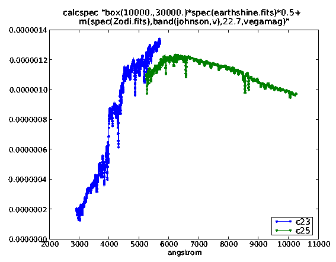
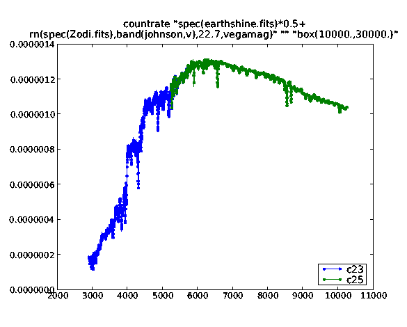
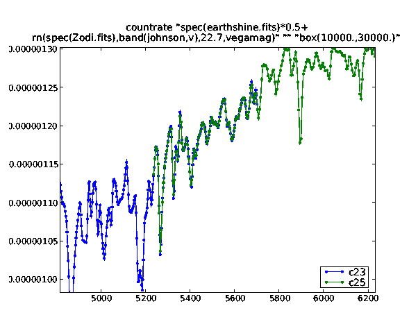

TSR 2008-01: Calcspec/Countrate Discrepancy Report
======================================================

:Authors: Victoria G. Laidler and Howard Bushouse
:Date:   10 July 2008

Abstract
===========
During the pysynphot commissioning process, anomalous results were 
discovered in the calcspec comparison tests. Further investigation revealed
a bug in the SYNPHOT.CALCSPEC task that produces incorrect flux values for some
wavelength bins when a user-specified
wavelength table is provided. The bug is clearly in SYNPHOT, and does
not affect the SYNPHOT.COUNTRATE task. 

Failed syn_pysyn comparisons
=========================================

Two representative cases were selected from the large pysynphot commissioning 
test set (aka syn_pysyn) for detailed investigation. These cases::

    stis_etc_cases/SpecSourcerateSpecCase23
      tda_Obsmode=stis,ccd,g430l
      tda_Spectrum=spec(earthshine.fits)*0.5+rn(spec(Zodi.fits),band(johnson,v),22.7,vegamag)

    stis_etc_cases/SpecSourcerateSpecCase25
      tda_Obsmode=stis,ccd,g750l,c7751
      tda_Spectrum=spec(earthshine.fits)*0.5+rn(spec(Zodi.fits),band(johnson,v),22.7,vegamag)

differ only in obsmode, yet show significantly different results. In what follows, "syn" refers to the synphot results; "pysyn" refers to the pysynphot results compared on the synphot wavelength table; and discrepancies are calculated as (syn-pysyn)/syn. The earthshine.fits and Zodi.fits are spectrum files used by the ETC and in many of the commissioning test cases::

    case23:cs  pysyn < syn  (counts and photlam) 
    case25:cs  pysyn > syn  (counts and photlam)

    case23 and case25: testspecphotlam results are identical fail,
                       non-extreme, most notable difference is at the
                       end perhaps due to tapering; but there are also
                       slight differences in the narrow features

    case23 and case25: testthru passes

    Case23:: tra_Discrepmean=1.70936656617e-10 
    Case23:: tra_Outliers=0
    Case23:: tra_Discrepmax=1.98063708812e-07 
    Case23:: tra_Discrepstd=5.91500353683e-08 
    Case23:: tra_Discrepfrac=0.0
    Case23:: tra_Discrepmin=-2.24487489258e-07

    Case25:: tra_Discrepmean=-1.31022519282e-09 
    Case25:: tra_Outliers=0 
    Case25:: tra_Discrepmax=2.36381865556e-07 
    Case25:: tra_Discrepstd=6.30496455361e-08 
    Case25:: tra_Discrepfrac=0.0
    Case25:: tra_Discrepmin=-2.31917703813e-07

Investigating SYNPHOT.calcspec
========================================

We used the genwave task to create wavesets c23.fits and c25.fits,
corresponding to the entries in the standard wavecat. Notably, the bin spacing (dwave) 
for c23 = 2.7A, while for c25=4.9A.

The wavecat entries used to define these tables are::

   stis,g430l              (2900.0,5700.0,2.7)
   stis,g750l,c7751        (5236.0,10266.0,4.9)

We then used calcspec to generate the spectrum alone, but using these
obsmode-related wavesets.We did this both in photlam and in counts.

We discovered that in the area in which the wavesets overlapped, the
spectra were offset from each other, *even in photlam*, which should be
independent of the bin size because it is a unit of photons per
angstrom. 

   These spectra should be identical in the overlap area, but an offset is clearly visible.

In counts, the offset was bigger, and close to the expected
factor of 1.8 due to the difference in binsize. 

Investigating SYNPHOT.countrate
================================

We used countrate and lied to it with a box(10000,30000) to simulate
not using an obsmode. These results do not show the effect.

   A zoomed version of the above plot shows good agreement between the spectra.

Conclusions
============

Calcspec is broken. The origin of the bug is unknown. No further investigation is warranted because SYNPHOT is in rusty-rail mode. 

A workaround is available. The countrate task does not exhibit this bug. Unlike calcspec, countrate requires an obsmode, but a box wide enough to encompass the entire desired spectrum can be provided instead. The syntax is demonstrated in Appendix 1.

We should not be comparing pysynphot to calcspec. The pysynphot commissioning tests will use this workaround for spectrum-only comparison tests.

Appendix 1: Synphot commands used to generate the test files
============================================================

Here are the commands we used for these tests::

     calcspec
        "spec(earthshine.fits)*0.5+rn(spec(Zodi.fits),band(johnson,v),22.7,vegamag)"
        c25_cs_noobs.fits wavetab=c25.fits

     calcspec
     "spec(earthshine.fits)*0.5+rn(spec(Zodi.fits),band(johnson,v),22.7,vegamag)"
     c23_cs_noobs.fits wavetab=c23.fits 
    
    calcspec
     "spec(earthshine.fits)*0.5+rn(spec(Zodi.fits),band(johnson,v),22.7,vegamag)"
     c25_cs_noobs_counts.fits form=counts wavetab=c25.fits 
    
    calcspec
     "spec(earthshine.fits)*0.5+rn(spec(Zodi.fits),band(johnson,v),22.7,vegamag)"
     c23_cs_noobs_box.fits form=photlam wavetab=c23.fits

     calcspec
     "box(10000.,30000.)*spec(earthshine.fits)*0.5+rn(spec(Zodi.fits),band(johnson,v),22.7,vegamag)"
     c25_cs_box_photlam.fits form=photlam wavetab=c25.fits

     calcspec
     "box(10000.,30000.)*spec(earthshine.fits)*0.5+rn(spec(Zodi.fits),band(johnson,v),22.7,vegamag)"
     c23_cs_box_photlam.fits form=photlam wavetab=c23.fits

     countrate
     "spec(earthshine.fits)*0.5+rn(spec(Zodi.fits),band(johnson,v),22.7,vegamag)"
     "" "box(10000.,30000.)" form=photlam
     out=c23_cr_box_photlam.fits wavecat=c23.cat     
    
    countrate
     "spec(earthshine.fits)*0.5+rn(spec(Zodi.fits),band(johnson,v),22.7,vegamag)"
     "" "box(10000.,30000.)" form=photlam
     out=c23_cr_box_photlam.fits wavecat=c23.cat   
    
    countrate
     "spec(earthshine.fits)*0.5+rn(spec(Zodi.fits),band(johnson,v),22.7,vegamag)"
     "" "box(10000.,30000.)" form=photlam
     out=c25_cr_box_photlam.fits wavecat=c25.cat

Appendix 2: Associated data
=============================

The data used and produced by this investigation can be
:download:`downloaded here <tsr_2008_01_data.tar.gz>`.

  Original location of sample case files: 
     /eng/ssb/syn_pysyn/8jul_r505M/stis_etc_cases/*/

